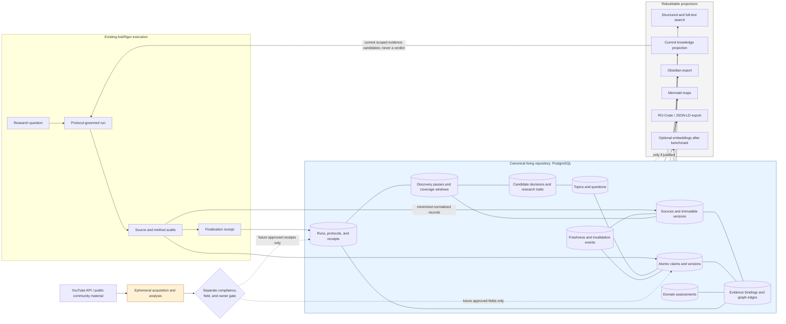
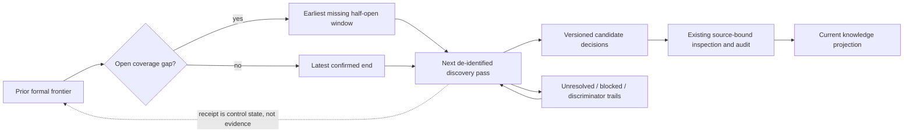
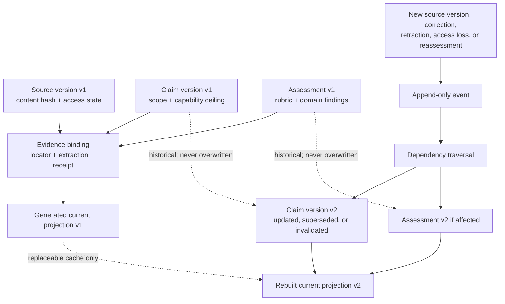
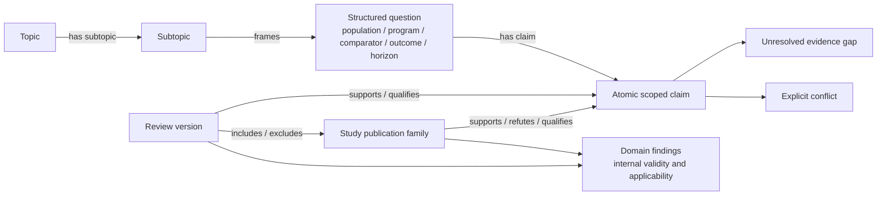

# Living evidence repository map

Date: 2026-08-30
Status: production study-audit read-through deployed; formal research-frontier
ledger implemented and locally verified; derived control surface, not
implementation authority

This map is a navigational projection of the proposed design in
`../superpowers/specs/2026-08-29-cumulative-living-evidence-repository-design.md`.
The canonical protocol files, executable AskRigor contracts, stored records,
and signed receipts remain authoritative. A generated diagram never proves
that an evidence check or update occurred.

## System and persistence boundary

The database has no public endpoint or raw corpus store, and the public service
has no writer. The one-shot administrator can import a reviewed source-free
study audit or a reviewed de-identified formal research frontier. There is no
automatic public-run ingestion and no vector or graph service.

The implemented local pilot now contains three linked topics, one structured
question, six public source families, seven source/claim versions including one
explicit synthetic invalidation, partial historical analysis versions, evidence
bindings, transparent assessment profiles, freshness checks, and one completed
impact job. It generates exact JSON, Obsidian, Mermaid, and RO-Crate views,
then dumps, wipes, restores, and hash-compares the named disposable schema.
The real-PostgreSQL acceptance schema separately proves complete performed-
analysis storage without truncation; missing historical analysis is never
reconstructed. The pilot persists zero YouTube/community records or derived
community assertions.
The current pilot additionally contains one nonempty formal frontier with one
lane, two complete passes, one deliberately open coverage gap, one versioned
candidate decision, and two executable trails. Its canonical export, Obsidian
note, Mermaid map, logical dump, destructive disposable-schema wipe, restore,
inventory, and canonical SHA-256 equivalence all pass. The separate acceptance
schema verifies initial/corrected current projections, full history, stale-
branch rollback, external gap enforcement, and cross-layer scope checks.
Railway remains unprovisioned because its current workspace-wide $10 minimum
hard limit and non-downsizeable paid volume cannot enforce the approved $5 and
1 GiB task-lock boundaries. No workspace billing control was changed.

## Production read-through loop

~~~mermaid
flowchart LR
    ACQ[Current lawful full-text acquisition] --> HASH[Exact identifiers + source SHA-256]
    HASH --> LOOKUP[(Private PostgreSQL reader)]
    LOOKUP -->|one exact current compatible candidate| AD[Candidate advertisement]
    LOOKUP -->|miss, timeout, ambiguous, stale, or incompatible| FRESH[Fresh study audit required]
    ACQ --> EXH[Read current document to exhaustion]
    AD --> EXH
    EXH --> RECHECK[Reload exact analysis version and repeat every gate]
    RECHECK -->|pass| VALIDATE[Existing deterministic 13-domain validator]
    RECHECK -->|fail| FRESH
    FRESH --> VALIDATE
    VALIDATE --> RECEIPT[Source-linked validated audit receipt]
    RECEIPT -. reviewed one-shot admin import only .-> LOOKUP
~~~

The candidate lookup runs once at acquisition and again only when reuse is
requested; continuation pages never wait on PostgreSQL. The dashed import edge
is not a public write path. It represents a separate administrator-reviewed
stdin import that persists no source body and is not invoked automatically by
MCP or Actions.

## Formal research-frontier loop

Requested and confirmed windows are distinct. A complete pass is exhausted and
confirms its exact request. Partial or retryable work exposes the next
capability. A terminal block exposes a reason and no false coverage. Candidate
and trail corrections append versions; a stale sibling is rejected. The loop is
formal-only until a separate policy decision changes the current zero-storage
YouTube/community boundary.

## Evidence lineage and correction propagation

The dependency traversal is fail-closed: an event that has not completed its
impact analysis cannot leave affected knowledge labeled current merely because
an old map or search document still exists.

## Freshness state machine

```mermaid
stateDiagram-v2
    [*] --> current: validated version + policy
    current --> due: cadence expires or trigger arrives
    due --> checking: worker claims refresh job
    checking --> current: no material change; receipt recorded
    checking --> superseded: newer valid source or claim version
    checking --> invalidated: retraction, correction, or fatal integrity event
    checking --> inaccessible: source cannot be inspected
    checking --> stale: retryable checks exhausted or deadline missed
    inaccessible --> checking: access restored / scheduled retry
    stale --> checking: scheduled or manual retry
    superseded --> [*]
    invalidated --> [*]
```

`inaccessible` and `stale` are not negative evidence. Historical versions
remain queryable, but the default current projection excludes invalidated and
superseded versions and visibly qualifies stale or inaccessible dependencies.

## Topic and evidence views

Generated views should include:

- a topic/subtopic explorer;
- an intervention-by-outcome evidence map;
- a review-by-included-study matrix;
- claim lineage with support, refutation, qualification, duplication, and
  supersession edges;
- a domain-level method and applicability view; and
- a freshness queue showing due, failed, inaccessible, invalidated, and
  superseded records without collapsing them into one score.

The topic explorer covers every topic and subtopic represented by accepted
records. An absent topic means “not yet indexed,” not “no evidence exists.”

The research-frontier view is separate from the current-knowledge projection.
It shows where discovery actually looked, requested and observed date ranges,
pagination/sampling/exhaustion, candidates accepted/rejected/deferred and why,
open questions, and unattempted/blocked/exhausted trails. A later run begins
from both views: it revalidates current knowledge, searches deltas since prior
coverage, and pursues high-value open trails. It never treats an old final
answer as proof that discovery is complete.

## Map maintenance rule

Every implemented schema or workflow change that affects a node, state,
persistence boundary, generated view, or correction path must update this file
in the same reviewed change. Generated exports may add detail, but this small
map remains the human control surface for architecture review.
