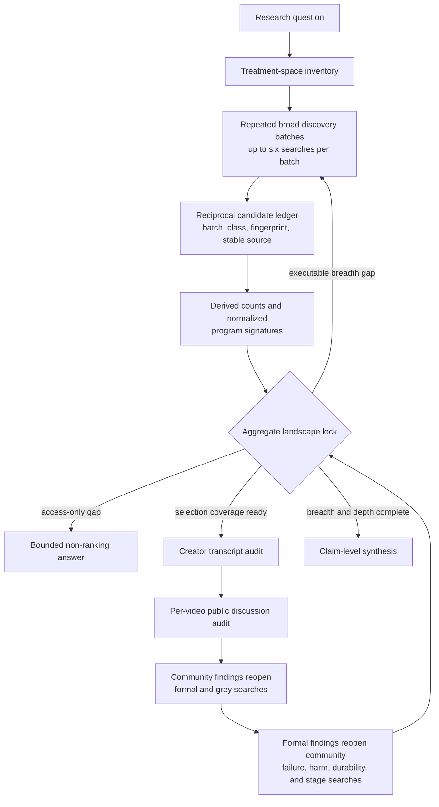
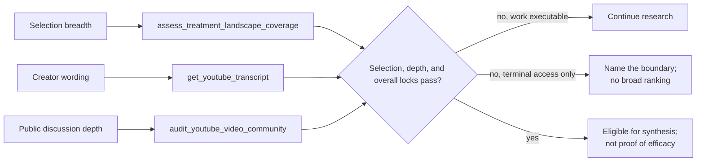

# Treatment-landscape workflow

This map explains the current implementation. Canonical behavior remains in
`protocols/HRP_Full.xml`, `project/PROJECT_INSTRUCTIONS.md`, and
`project/FORUM_SIGNAL_MODULE.md`.

## End-to-end flow

## Separate locks

The separate selection, per-video-depth, and overall locks do not judge whether
a treatment works or independently prove the semantic inventory is complete.
They check the supplied receipt-linked ledger and prevent a
deeply audited but narrow set—such as many near-identical exercise videos—from
standing in for a diverse treatment landscape. Candidate counts, normalized
program diversity, and independent-source counts are derived; invalid records
are excluded. Numeric ranges are planning warnings; decision-relevant or
uncertain omissions, missing directional searches, incomplete formal return
passes, unresolved selected-source receipts, and executable expansion are
blockers. A supported not-decision-relevant omission is only a warning.
Terminal gaps count only when a structured boundary matches the literal source
state and affected scope, is nonretryable, and records attempted recovery.
